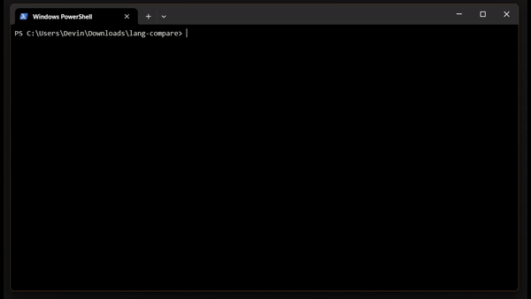
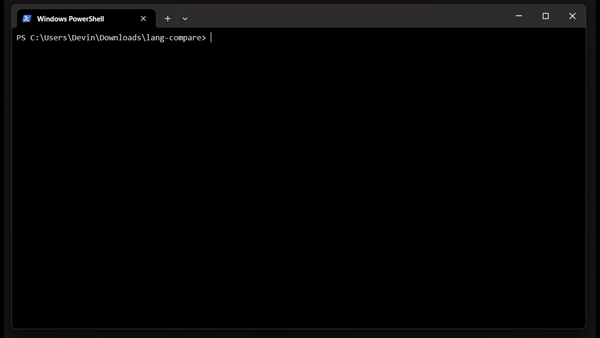

# Lang Compare

### C

### Python

# Description

This code compares the speed of Python and C on your machine using brute force matrix multiplication and recursive Fibonacci sequence number finding. Since Python is an interpreted language, it tends to be much slower than compiled languages like C. Python is especially slow at recursion.

# Requirements

* [Python 3](https://www.python.org/downloads/)
* C/C++ compiler
    * If you're using Windows, you can install gcc through [MinGW-w64](https://www.mingw-w64.org/downloads/#mingw-builds). You may need to add the included bin folder to your PATH depending on which compiler you choose.

# How to run the Python version

You can run the Python version with this command:
* python3 run_python.py

Depending on how powerful your machine is, this may take a while. When it's finished, it will display the number of seconds it took. It will do this for both Fibonacci and matrix multiplication.

# How to run the C version

The code will need to be compiled first. If you're on Windows and using MinGW-w64, simply run these commands:
* mingw32-make
* .\run_c.exe

If you're on Windows and using Visual Studio, create a new project in Visual Studio and load the main.c file into it, then compile and run it.

If you're on Mac or Linux, run these commands:
* gcc main.c -o run_c
* ./run_c
